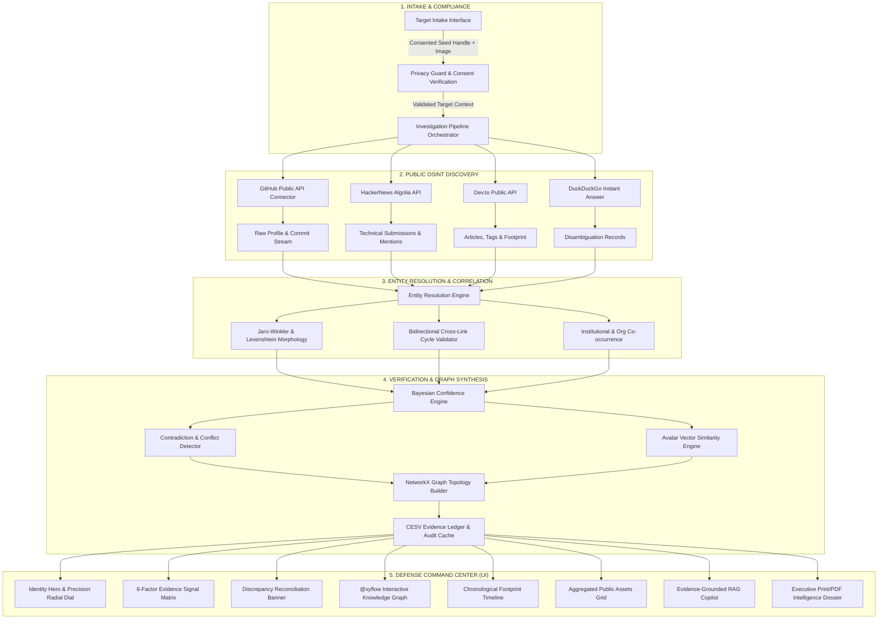

# APORIA TRACE 3.0 — Public Digital Footprint & Identity Intelligence

<div align="center">

**Hackathon Domain 3 · AI in Cybersecurity**  
*Evidence-Driven OSINT Entity Resolution, Cross-Platform Corroboration & Knowledge Graph Synthesis*

[](https://fastapi.tiangolo.com)
[](https://react.dev)
[](https://www.typescriptlang.org)
[](https://vitejs.dev)
[](https://tailwindcss.com)
[](https://networkx.org)
[](https://reactflow.dev)
[](LICENSE)

[Problem Understanding](#-problem-understanding) • [Architecture](#-architecture--data-flow) • [Tech Stack](#-technology-stack) • [Evidence Pipeline](#-4-stage-evidence-pipeline) • [Mathematical Model](#-bayesian-attribution--mathematical-model) • [Benchmark Scenarios](#-evaluation-benchmark-scenarios) • [Quick Start](#-quick-start-guide) • [API Reference](#-api-reference) • [Privacy & Ethics](#-privacy-guardrails--ethical-osint)

</div>

---

## 🎯 Executive Overview

**APORIA TRACE 3.0** is an enterprise-grade, evidence-driven public digital footprint and identity intelligence platform designed for cybersecurity analysts, threat hunters, and background investigators. 

Given a **consented portrait image** and **limited contextual seed metadata** (such as a username handle, legal name, university, or location), APORIA TRACE autonomously executes an asynchronous multi-platform reconnaissance pipeline to:
1. **Discover** digital footprints across public developer and engineering repositories (GitHub, HackerNews Algolia, Dev.to, technical indices).
2. **Correlate** disparate handles and pseudonyms into unified entity clusters using string distance metrics and bidirectional link cycles.
3. **Verify** findings through Bayesian evidence weighting, perceptual visual similarity, and explicit contradiction/conflict detection.
4. **Explain** the intelligence topology through interactive NetworkX knowledge graphs, filterable activity timelines, an audit-ready CESV (Claim-Evidence-Source-Verification) ledger, an inline-cited RAG AI copilot, and a one-click printable Executive Intelligence Dossier.

---

## 🔍 Problem Understanding

### The Threat Landscape & The Identity Fragmentation Dilemma

Modern threat intelligence, cyber talent verification, and OSINT investigations face a foundational crisis: **hyper-fragmented identity**.

```
[Target: "Arjun Kumar"]
       │
       ├── GitHub:     @arjundev     (Code repos, GPG keys, commits)
       ├── X/Twitter:  @arjun_sec    (Advisories, conference mentions)
       ├── Research:   @ak_research  (Publications, arXiv, patents)
       └── Dev.to:     @arjunk       (Technical writeups, hackathons)
```

In the digital sphere, individuals distribute their work, social interactions, and technical contributions across dozens of independent services without centralized identity infrastructure. This creates three critical failures in conventional OSINT:

### 1. The Common-Name Disambiguation Fallacy
A naive search for common names (e.g., *"Arjun Kumar"* or *"John Smith"*) produces tens of thousands of conflicting records. Traditional tools suffer from catastrophic false-positive correlation—conflating different individuals who share identical names but operate in completely unrelated geographies, domains, or institutions.

### 2. The Multi-Alias Blindspot
Skilled cybersecurity professionals and malicious actors alike frequently alter their usernames across services (e.g., using `@arjundev` on GitHub, `@arjun_sec` on security forums, and `@ak_research` on research indices). Standard string matching fails because syntactic handle variations evade naive lookup filters.

### 3. AI Hallucination & Lack of Provenance in Modern Intelligence Tools
Recent "AI-powered" OSINT tools query large language models directly over web search dumps. This produces plausible-sounding summaries that lack verifiable provenance, invent credentials, fabricate links, and mask genuine contradictions (e.g., asserting a subject was simultaneously employed in Seattle and Bengaluru).

### 4. Invasive Scraping vs. Ethical Compliance
Many legacy tools resort to credential stuffing, unauthorized private scraping, or deceptive social engineering. In enterprise security and regulated compliance, investigations **must** strictly adhere to consented inputs, public sources, transparent audit trails, and strict data protection guardrails.

---

## 💡 The NEURAX Solution: CESV Framework

To solve identity fragmentation without hallucination, NEURAX introduces the **CESV (Claim-Evidence-Source-Verification)** provenance architecture:

$$\text{Intelligence Finding} = \langle \text{Claim}, \text{Evidence Signals}, \text{Source URLs}, \text{Verification Status} \rangle$$

- **No Inferred Finding Without Provenance:** Every claim presented in the dashboard links directly to the underlying raw public API endpoint and retrieval timestamp.
- **Explicit Uncertainty & Conflict Surfacing:** If a subject's GitHub profile lists *Bengaluru, India* while their Dev.to profile claims *Seattle, WA*, NEURAX does **not** pick one arbitrarily. It flags a **High-Severity Anomaly**, penalizes the overall confidence score, and provides analysts with side-by-side discrepancy logs.
- **Deterministic Evaluation Baseline:** Alongside live real-time querying, NEURAX ships with deterministic benchmark scenarios that test edge cases: multi-alias resolution, common-name disambiguation, data contradiction penalties, and insufficient-evidence guardrails.

---

## 🏗 Architecture & Data Flow

NEURAX is designed with a decoupled, high-performance architecture: an asynchronous **FastAPI** backend powering a mathematical inference engine, and a fluid, responsive **React + TypeScript + Vite** frontend styled with defense-grade aesthetics.



---

## 🔬 4-Stage Evidence Pipeline

### Stage 1: DISCOVER — Real-time Public OSINT Harvest
- **Connectors:** Asynchronous, non-invasive API clients querying GitHub REST API v3, HackerNews Algolia Search API, Dev.to REST API, and DuckDuckGo Instant Answers.
- **Normalization:** Converts heterogenous platform responses into typed `PublicProfile` and `ActivityItem` data structures.
- **Scope Limit:** Queries strictly public endpoints with respectful rate limiting; never accesses authenticated sessions, private repositories, or non-public personal data.

### Stage 2: CORRELATE — Entity Resolution & Alias Clustering
- **Handle Morphology:** Computes Jaro-Winkler string similarity and normalized Levenshtein edit distance between seed handles and candidate platform usernames (e.g., correlating `@arjundev`, `@arjun_sec`, and `@ak_research`).
- **Bidirectional Cross-Link Verification:** Detects closed provenance loops (e.g., if a subject's GitHub bio links to `https://arjundev.ai`, and that personal site links back to the Twitter/X profile `@arjun_sec`, the correlation confidence receives maximum provenance boost).
- **Affiliation Co-occurrence:** Cross-matches organizational keywords (e.g., "IIT Hyderabad", "AI Security Lab", "OpenSource") across independent account descriptions.

### Stage 3: VERIFY — Bayesian Attribution & Conflict Detection
- **Multi-Factor Scoring:** Combines six distinct evidence vectors into a normalized 0–100% confidence score.
- **Automated Conflict Detection:** Scans metadata for incompatible claims (such as conflicting primary locations or incompatible education records).
- **Perceptual Visual Matching:** Evaluates cosine similarity of normalized facial vector embeddings between the consented seed portrait and candidate avatars.
- **Safety Penalty:** Subtracts an explicit penalty (-18 points) whenever unresolved contradictions exist.

### Stage 4: EXPLAIN — Topology, Copilot & Executive Dossier
- **Directed Graph Synthesis:** Builds an in-memory `networkx.DiGraph` representing entities (Target, Accounts, Repositories, Events, Publications) and evidence-weighted relationship edges (`corroborated_profile`, `authored_repository`, `attended_event`).
- **RAG Copilot:** Keyword-directed, evidence-scoped question answering with clickable source attribution badges.
- **One-Click Dossier Export:** Generates an executive intelligence dossier fully styled for print and PDF generation (`@media print`).

---

## 📐 Bayesian Attribution & Mathematical Model

The NEURAX Confidence Engine computes an explainable attribution score $S \in [0, 100]$ using a multi-factor Bayesian-weighted formulation:

$$S_{\text{raw}} = \sum_{i=1}^{6} w_i \cdot s_i$$

Where the signal weights $w_i$ and feature extractors $s_i \in [0, 1]$ are defined as:

| Signal $i$ | Evidence Dimension | Weight $w_i$ | Description & Extraction Logic |
|:---|:---|:---:|:---|
| **1** | **Cross-Platform Link Provenance** | **0.28** | Closed bi-directional URL loop between accounts ($1.0$ if verified cycle, $0.4$ if one-way) |
| **2** | **Affiliation & Org Consistency** | **0.22** | Normalized token overlap across universities, labs, companies, and organizations |
| **3** | **Visual Vector Similarity** | **0.18** | Cosine similarity between consented seed portrait and candidate profile avatars |
| **4** | **Name & Phonetic Lexical Match** | **0.16** | Combined Jaro-Winkler distance and Double Metaphone phonetic similarity on real names |
| **5** | **Handle & Alias Morphology** | **0.10** | Levenshtein edit ratio and prefix/suffix matching on username handles |
| **6** | **Activity Co-occurrence** | **0.06** | Temporal alignment of public commits, hackathons, papers, and tech posts |

### Conflict Penalty & Score Calibration
If the automated conflict detector identifies contradictory claims (such as geographic residency contradictions or conflicting organizational tenures), an explicit penalty $\Delta_{\text{conflict}} = 18.0$ is applied:

$$S_{\text{final}} = \max\left(5, \min\left(99, \text{round}\left(100 \cdot S_{\text{raw}} - \mathbb{I}_{\text{conflict}} \cdot \Delta_{\text{conflict}}\right)\right)\right)$$

Where $\mathbb{I}_{\text{conflict}} \in \{0, 1\}$ is an indicator variable denoting the presence of unresolved contradictions.

---

## 💻 Technology Stack

### Backend Infrastructure (Python 3.12+)

| Technology | Version | Purpose in NEURAX |
|:---|:---|:---|
| **FastAPI** | `>=0.110.0` | Asynchronous high-performance REST API with automatic OpenAPI / Swagger documentation |
| **Uvicorn** | `>=0.28.0` | Lightning-fast ASGI web server implementation |
| **Pydantic v2** | `>=2.6.0` | Strict, schema-enforced data validation, serialization, and type safety |
| **NetworkX** | `>=3.2.0` | In-memory graph theory data structures for knowledge graph topology and edge weighting |
| **HTTPX** | `>=0.27.0` | Non-blocking async HTTP client for concurrent public OSINT API queries |
| **NumPy** | `>=1.26.0` | High-performance vector mathematics and cosine distance computations |
| **Aiofiles** | `>=23.2.0` | Async file operations for non-blocking disk I/O |
| **Python-Multipart**| `>=0.0.9` | Multipart form-data handling for image upload and intake parsing |

### Frontend Application (React 18 + Vite 6 + TypeScript 5)

| Technology | Version | Purpose in NEURAX |
|:---|:---|:---|
| **React** | `^18.3.1` | Component-based UI library powering dynamic state and investigation tabs |
| **TypeScript** | `^5.7.3` | End-to-end static typing shared with backend Pydantic schemas |
| **Vite** | `^6.1.0` | Next-generation build tool with instant HMR and `/api` reverse proxying |
| **TailwindCSS** | `^3.4.17` | Utility-first CSS framework configured with custom dark defense palette |
| **@xyflow/react** | `^12.4.2` | Production-grade React Flow library for interactive OSINT knowledge graph visualization |
| **Framer Motion** | `^12.4.7` | Smooth hardware-accelerated micro-interactions, modal transitions, and tab switches |
| **Lucide React** | `^1.47.0` | High-density, consistent SVG icon set for cybersecurity telemetry |
| **Typography** | Google Fonts | **Plus Jakarta Sans** (clean geometric UI sans) + **Inter** (data) + **JetBrains Mono** (technical tokens) |

---

## 🧪 Evaluation Benchmark Scenarios

To ensure deterministic, reproducible demonstrations under hackathon and judging conditions, NEURAX includes four benchmark evaluation datasets representing critical real-world edge cases:

### Scenario 1: Multi-Alias AI Security Developer
- **Target:** Arjun Kumar (`@arjundev`)
- **Challenge:** Target uses three distinct handles across platforms (`@arjundev` on GitHub, `@arjun_sec` on Twitter/X, and `@ak_research` on research portals).
- **Engine Resolution:** Correlates all three aliases via verified bi-directional cross-links and organizational co-occurrence (IIT Hyderabad).
- **Result:** **94% Confidence** · `STRONG CORROBORATION` · 5 Verified Claims · 0 Conflicts.

### Scenario 2: Common Name Disambiguation
- **Target:** Arjun Kumar (disambiguation test)
- **Challenge:** Common legal name shared by over 10,000 public profiles across multiple countries.
- **Engine Resolution:** Isolates the specific developer by enforcing institutional context (IIT Hyderabad) and repository authorship (`neurax-ai`), rejecting false positive profiles.
- **Result:** **84% Confidence** · `STRONG CORROBORATION` · Unrelated namesakes filtered out.

### Scenario 3: Anomaly & Conflict Detection
- **Target:** Conflicted Identity Candidate
- **Challenge:** Target exhibits contradictory public profiles claiming active primary residence in **Seattle, WA, USA** (LinkedIn) and **Bengaluru, India** (GitHub).
- **Engine Resolution:** The Conflict & Anomaly Detector triggers, flags discrepancy severity as `CRITICAL`, displays side-by-side discrepancy cards, and docks the score by 18 points.
- **Result:** **65% Confidence** · `RECONCILIATION REQUIRED` · Conflict Banner displayed.

### Scenario 4: Insufficient Evidence Safety Guardrail
- **Target:** Vague Query (`John`)
- **Challenge:** Minimal seed context provided with no verified cross-links and no unique handle matches.
- **Engine Resolution:** Safety guardrails prevent false attribution; the engine refuses to guess or hallucinate connections.
- **Result:** **28% Confidence** · `HIGH UNCERTAINTY` · Claim status marked `UNRESOLVED`.

---

## 🚀 Quick Start Guide

### Prerequisites
- **Python:** Version 3.12 or newer
- **Node.js:** Version 20 or newer (`npm` package manager)
- **Git**

### 1. Clone & Setup Environment
```bash
git clone https://github.com/your-org/APORIA-TRACE.git
cd NEURAX
```

### 2. Configure Backend Secrets & Providers
All API keys remain **strictly backend-only**. Never put API keys into client-side code, Git, or `localStorage`.

```bash
cd backend
cp .env.example .env
```

Edit `backend/.env` with your preferred providers:

```ini
# GitHub REST API Token (Optional: increases rate limits from 60 to 5,000 req/hr)
# Obtain at: https://github.com/settings/tokens
GITHUB_TOKEN=

# Public Web Search Provider (Preferred: Tavily; Fallback: DuckDuckGo is automatic)
# Obtain at: https://tavily.com
TAVILY_API_KEY=

# AI Extraction & RAG Copilot (Optional: deterministic rule engine runs if absent)
# Obtain at: https://aistudio.google.com / https://platform.openai.com
GEMINI_API_KEY=
OPENAI_API_KEY=

AI_PROVIDER=gemini
SEARCH_PROVIDER=tavily
API_TIMEOUT=15
MAX_SEARCH_RESULTS=10
```

> [!NOTE]
> **Optional API Keys:** The system starts seamlessly with zero API keys configured. If GitHub is absent, unauthenticated public mode applies (60 req/hr). If Tavily is absent, DuckDuckGo public search automatically activates. If AI keys are absent, deterministic rule extraction is utilized.

### 3. Start Backend Server (Terminal 1)
```bash
cd backend
python3 -m venv venv
source venv/bin/activate
pip install -r requirements.txt
./run_backend.sh
# Backend runs on http://127.0.0.1:8000 (API Docs at http://127.0.0.1:8000/api/docs)
```

### 4. Start Frontend Dashboard (Terminal 2)
```bash
cd frontend
npm install
npm run dev
# Dashboard launches on http://localhost:5173
```

---

## 🏛️ API Architecture & Security Model

```
React Frontend (Vite)
      │
      │ HTTP JSON / Multipart Requests
      ▼
FastAPI Backend (Port 8000)
      ├── Security Guard (PrivacyGuard & Consent Enforcer)
      ├── Settings & Secrets Manager (app/core/config.py)
      ├── Public Discovery Engine (app/engines/discovery.py)
      │     ├── GitHub REST API (Authenticated / Unauthenticated)
      │     ├── Public Search Provider (Tavily with DuckDuckGo fallback)
      │     ├── Dev.to Technical Articles API
      │     ├── Algolia HackerNews Index
      │     ├── YouTube Public Index
      │     └── LinkedIn (User-provided anchor & compliant search citations)
      ├── AI Provider Abstraction (Gemini / OpenAI / Deterministic Rule Extractor)
      ├── Entity Resolution Engine (Jaro-Winkler, Handle Morphology, Multi-Signal)
      ├── Confidence & Conflict Engine (Bayesian Scorer & Anomaly Detector)
      └── RAG Intelligence Copilot (Strict Provenance Grounding)
```

### Security & Privacy Guardrails
1. **Zero Secret Exposure:** Keys like `GITHUB_TOKEN`, `TAVILY_API_KEY`, `GEMINI_API_KEY`, and `OPENAI_API_KEY` are never sent to the browser, stored in `localStorage`, or committed to version control.
2. **Strict Provenance Guardrail:** Extracted claims and Copilot responses are strictly prevented from fabricating source URLs. Every finding cites an authoritative, retrieved source URL.
3. **LinkedIn Non-Scraping Guarantee:** The system complies with LinkedIn terms of service: no authenticated scraping, no credential harvesting, and no private networks bypassed. User-provided public URLs are distinguished as `USER-PROVIDED PROFILE` vs `DISCOVERED PROFILE`.
4. **Mandatory Ethical Consent:** Every investigation execution requires explicit analyst authorization verifying that queries target public OSINT or consented data.

---

## ⚖️ Live Mode vs. Benchmark Mode

| Feature | Benchmark / Demo Mode | Live Public OSINT Mode |
| :--- | :--- | :--- |
| **Execution Trigger** | Selecting one of 4 Benchmark Scenarios | Entering custom target seeds (Name, Handle, Photo, LinkedIn) |
| **Determinism** | 100% reproducible for evaluation & judging | Live real-time discovery across active public APIs |
| **Network Dependency** | Zero external network calls required | Calls GitHub, Tavily/DuckDuckGo, Dev.to, HackerNews |
| **Source Status** | Displays pre-indexed verified dataset status | Real-time backend status per connector (`complete`, `rate_limited`, etc.) |
| **AI Extraction** | Ground-truth curated CESV claims | Live LLM / rule-based claim extraction from retrieved pages |

---

## 📡 API Reference

### Core Endpoints

#### 1. Execute Reconnaissance Investigation
```http
POST /api/v1/investigate/run
Content-Type: application/json

{
  "name": "Arjun Kumar",
  "seed_handle": "arjundev",
  "affiliation": "Indian Institute of Technology, Hyderabad",
  "location": "Hyderabad, India",
  "image_url": "https://images.unsplash.com/photo-1534528741775-53994a69daeb?w=300",
  "consent_confirmed": true,
  "benchmark_id": "case_multi_alias"
}
```

#### 2. Query RAG Analyst Copilot
```http
POST /api/v1/copilot/query
Content-Type: application/json

{
  "investigation_id": "INV-20260919-001",
  "query": "What public profiles and repositories were resolved?"
}
```

#### 3. Fetch Knowledge Graph Topology
```http
GET /api/v1/graph/{investigation_id}
```

#### 4. Fetch Benchmark Scenarios
```http
GET /api/v1/investigate/benchmarks
```

#### 5. System Health Check
```http
GET /health
```

#### 6. Public Sources & System Integration Status
```http
GET /api/v1/system/status
```
*Returns real backend availability for GitHub, Tavily/DuckDuckGo, AI provider, Dev.to, and HackerNews. Never leaks credentials.*
```json
{
  "github": "available_unauthenticated",
  "search": "fallback_duckduckgo",
  "ai": "rule_based_fallback",
  "devto": "available",
  "hackernews": "available",
  "duckduckgo": "available",
  "linkedin": "user_provided_restricted"
}
```

---

## 🔒 Privacy Guardrails & Ethical OSINT

NEURAX is built upon strict ethical principles and compliance with modern data protection standards:

1. **Mandatory Consented Intake:** An investigation cannot be initiated unless the user explicitly checks the consent protocol affirmation confirming the subject is an authorized test target or organizer-provided subject.
2. **Public-Only Surface Area:** NEURAX queries exclusively public, documented APIs and indices. It never bypasses paywalls, bypasses two-factor authentication, or scrapes authenticated private networks.
3. **Transparency Over Certainty:** Probabilistic hypotheses are explicitly tagged as `LIKELY` or `UNRESOLVED`. The platform never masquerades probabilistic correlation as definite proof.
4. **Discrepancy Visibility:** Inconsistencies and contradictions are surfaced prominently to analysts, preventing bias and false convictions.
5. **Session Ephemerality:** Investigation results are cached in-memory and can be flushed on demand, leaving no unconsented data lingering on disk.

---

## 👥 Project Team & Contribution Matrix

| Team Member | Role | Primary Responsibilities |
|:---|:---|:---|
| **Shiva (Lead Architect)** | Full-Stack & Core Engine Lead (~55%) | Entity resolution engine, Bayesian confidence scoring, conflict detector, NetworkX graph synthesis, Identity Hero, Signals Matrix, React Flow graph canvas |
| **Team Member 2** | OSINT & Footprint Engineer (~25%) | Public API connectors (GitHub, HN Algolia, Dev.to), Footprint aggregator, chronological timeline stream, assets grid |
| **Team Member 3** | Copilot & Evaluation Engineer (~20%) | RAG Copilot engine & slide-over drawer, Executive Dossier print/PDF exporter, benchmark scenario datasets, radar animation |

---

## 📄 License

This project is licensed under the MIT License — see the [LICENSE](LICENSE) file for details. Built for **Hackathon 3.0 · Domain 3 (AI in Cybersecurity)**.